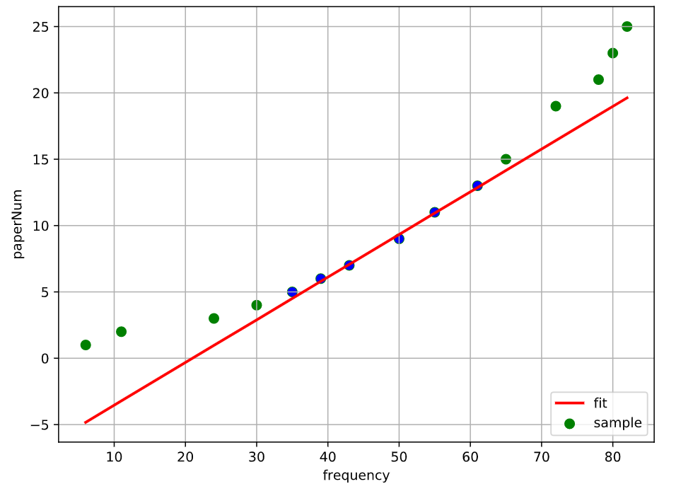

# paper-count

## 完成阶段一：计数器[basic-count](https://github.com/easilylazy/paper-count/tree/basic-count)

### 实现原理

对P3.7进行触发：接通GND，再断开，类似按键工作

再用P1.3进行记录，将脉冲发送到T0计数器端口P3.4，计数器在一次脉冲+1

### 功能

联合串口输入输出实现功能：

- 输入‘d’：展示现在的计数器数值

- 输入‘r’：重置计数器数值

## 完成阶段二：计时器[add-timer](https://github.com/easilylazy/paper-count/tree/add-timer)

### 实现原理

使用T2定时器，这是C52相比C51增加的资源，通过设定自动装载能够在50ms时产生中断的值，产生秒数

### 功能

每秒通过串口输出`*`,每分通过串口输出`&`

## 完成阶段三：卡尔曼滤波器[add-frequency](https://github.com/easilylazy/paper-count/tree/add-frequency)

### 实现原理

通过卡尔曼滤波器，将以上两阶段的计数器与计时器之比做为频率测量值Z，进行一维常量模式下的卡尔曼滤波，不断更新预测值。

### 功能

每秒通过串口输出，固定周期下的计数值`sum` 此周期的频率`freq` 以及经过滤波更新的测量值`kalman`

## 完成阶段四：数码管显示与按键交互[add-interactive](https://github.com/easilylazy/paper-count/tree/add-interactive)

### 实现原理

详情查看如下文章：
- [调试](https://www.motwo.cn/article/607e923abeed1d675f47b983)
- [加个按键](https://www.motwo.cn/article/6080d7fdbeed1d675f47b996)

拟合部分有两种实现:
- 最小二乘法
- 中间值法
### 功能

通过数码管显示，引导用按键进行操作，校正并得到测量结果

### 改进
在测量固定电容时基本没有问题，但测量纸张稳定性不好，需要对软硬件进行修改。
软件部分：
- 直接把555的输入接到T0（P3.4）处，避免二次加工
- TODO:
  - √ 减小测量区间（加快测量速度
  - √ 确定终结点-当偏差小于一定值时停止
  - √ 进一步减小误差！
硬件部分：
- 有时很稳定，有时不稳定
- 夹子是金属的，加上一层纸进行绝缘。
- 减小电路走线

### 进展

4/24 15:35 激动人心的事发生了：由于幸运更改了代码，现在的输出和纸张数几乎成线性正比！   
4/29 终期验收，10以内测量符合要求，但超过10张存在误差，原因是频率与纸张数并非精确的线性关系，校正选择的数据只是2.4.8张       
       对超过此限度的数据可靠性没有保证。为了达到基本要求：对11~15张纸的准确测量，重新测量数据进行可视化分析
      

    可以看出，整个样本点可分为3个区域，分别为低端、中端与高端
    因为在随着纸张数增多，在高端逐渐趋于线性不可分，那么我们主要研究低端和中端。不妨将测量分为两个区域，正如图中所示，在第二个区域（中端）测量得到的拟合曲线可以在该区域准确反映变化。

